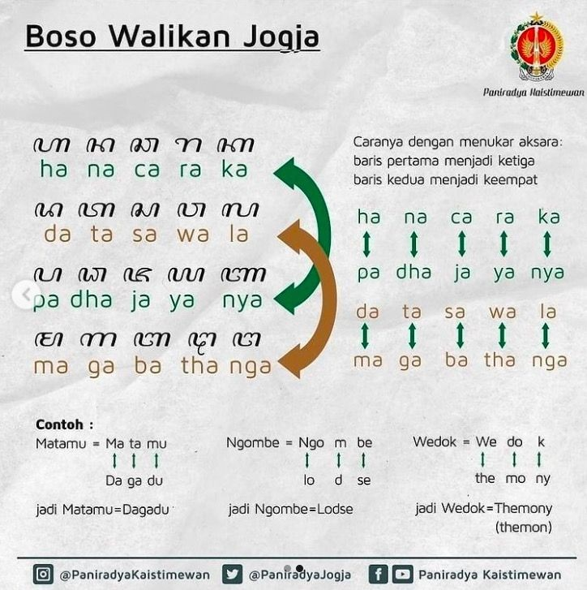

# Jogoel-lang

A Jogoel-lang encoding algorithm, a simple conversion of the popular slang in Jogja commonly known as "basa walikan". This is not
a programming language, yep, this is for cryptography purpose.

Includes encoding functions that convert text to the logic used. It doesn't have
a specific encoding key like encoding in general, but only changes each group of
letters in the Javanese script (aksara Jawa).

## Algorithm

Javanese script consists of 20 characters, arranged in four lines, each consisting of five characters.

1. Ha Na Ca Ra Ka
2. Da Ta Sa Wa La
3. Pa Dha Ja Ya Nya
4. Ma Ga Ba Tha Nga

To use `basa walikan`, substitute the characters in the first line to the characters
in the third line, and the characters in the second line to the characters in
the fourth line, and vice versa.



## Usage

- Open the nodejs interpreter by typing `node` on your terminal
- import library:
	```javascript
	const slang = require('jogoel-lang');
	```
- Now, u can use `encode` and `decode` function to convert a plaintext into
ciphertext and vice versa.
	```javascript
	console.log(slang.encode('mas'))
	console.log(slang.decode('poya haha'))
	```

## NOTE

This is just a fun project and i'm not taking seriously developing it. But, u can
contributing by make PR or creating an issue.